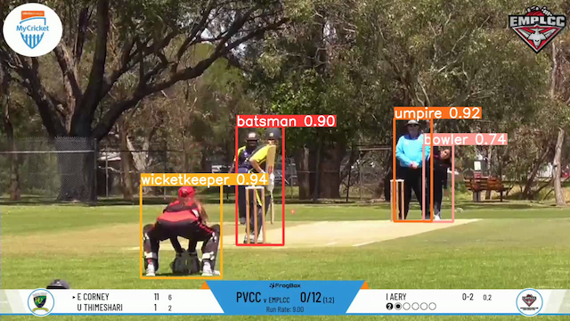

[](https://discord.gg/JvMQgMkpkm)
[](https://eval.ai/web/challenges/challenge-page/2077/overview)
[](http://mmsports.multimedia-computing.de/mmsports2023/challenge.html)

# The DeepSportradar Cricket Bowl Release Challenge (2023)


Welcome to the first edition of the DeepSportradar Cricket Bowl Release Challenge, which is one of the [ACM MMSports 2023 Workshop](http://mmsports.multimedia-computing.de/mmsports2023/index.html) challenges. 
An opportunity to publish, as well as winning a $1000 prize by competing on [EvalAI](https://eval.ai/web/challenges/challenge-page/2077/overview). 
See [this page](http://mmsports.multimedia-computing.de/mmsports2023/challenge.html) for more details about our challenges.
These challenges are associated with the 6th Intrnational ACM Workshop on Multimedia Content Analysis in Sports.
In this challenge, participants will have to segment the input video to recognize the bowl release action.

## NOTE: The challenge dataset is scheduled to be made available within the next two weeks. For now, please treat the current repository as a preview of the final challenge. Note that certain modifications will be necessary once the final version of the dataset is released. The baseline will be trained and released accordingly, while the evaluation metric will remain unchanged.

The dataset is split into training, test and challenge sets. Annotations will be provided for the first two splits and hidden for the latter.
Data have been annotated internally by Sportradar. Videos are extracted from real matches and consist in about two "overs".
The dataset will be relased publicly for research purposes only.

The objective of this challenge is to segment the specific parts of videos where a bowl release action occurs, focusing on detecting the full time window of the action. 
This differs from other action detection tasks, that treat actions as single moments in time. 
Typically lasting around 100 frames, the event detection aims to identify all instances of bowl release events.

## Metrics

As the challenge objective is to identify all instances of bowl release, we decided to treat the problem as instance segmentation through time.
For this reason, we use the Panoptic Quality as metric. 

Panoptic Quality is a metric used to evaluate the performance of instance segmentation algorithms in computer vision. Instance segmentation involves identifying and delineating individual objects within an image, assigning each pixel to a specific object instance. Here we want to measure the model ability to identify and delineate individual bowl releases action instances, assigning each frame to a specific action event instance.

Panoptic Quality combines two key aspects of instance segmentation: segmentation quality and recognition quality. It measures the accuracy of both the object boundary delineation (segmentation quality) and the correct association of each segment with the corresponding object category (recognition quality).

To calculate Panoptic Quality, the algorithm's output is compared against ground truth annotations. The metric takes into account true positives (correctly segmented and recognized action events), false positives (over-segmented or misclassified action events), and false negatives (missed action events). It assigns scores based on the intersection over union (IoU) between the algorithm's segmentation masks and the ground truth masks. In this challenge we only consider IoUs when above to the 0.5 threshold.

Panoptic Quality is computed using the following formula:

$\text{Panoptic Quality} = PQ = \frac{\sum_{(p,g)\in{TP}}IoU(p,g)}{|TP| + \frac{1}{2}|FP| + \frac{1}{2}|FN|}.$


Where:

- IoU is the Intersection Over Union ratios for all true positives.
- TP is the number of true positives.
- FP is the number of false positives.
- FN is the number of false negatives.

The matric can be further broken in:

$\text{Panoptic Quality} (PQ) = \text{Segmentation Quality} (SQ) \times \text{Recognition Quality} (RQ) = \frac{\sum_{(p,g)\in{TP}}IoU(p,g)}{|TP|} \times \frac{|TP|}{|TP| + \frac{1}{2}|FP| + \frac{1}{2}|FN|}$ .


Please refer to the [Submission on EvalAI section](#submission-on-evalai) for the submission format.
    
Maintainers: Davide Zambrano (d.zambrano@sportradar.com) from Sportradar.


&nbsp;
<p align="center"></p>

## Installation

**Note that the file ```setup.py``` specifies the libraries version to use to run the code.**

Install [PyTorch](http://pytorch.org/). 

```shell
git clone https://github.com/DeepSportradar/cricket-bowl-release-challenge/tree/v0.0.0
cd cricket-bowl-release-challenge
pip install -e .
```

## Example

Run the following command to train a baseline model:
```shell
python main.py --epochs 50
```

## Data

Data have been annotated internally by Sportradar. We are preparring to make them publicly available and these operations will take approximately two weeks to complete.

## Submission on EvalAI
Submit your result through the [challenge page on the EvalAI platform](https://eval.ai/web/challenges/challenge-page/2077/overview).

The submission file has to be a ```json``` with the following format:

```json

{
    "video_0": {"0": [10, 100], "1": [350, 400]},
    "video_1": {"0": [100, 200], "1": [350, 450]},
    "video_n": {"0": [1000, 1100], "1": [350, 450]}
}

```
Where: 

- the keys identify the videos in the split;
- then for each video, a Dict is expected with unique identifiers for each detected action;
- each detected action is represented by a list containing the starting and ending frames for that action.


Please refer to the challenge webpage for complete rules, timelines and awards: [https://deepsportradar.github.io/challenge.html](https://deepsportradar.github.io/challenge.html).

## Questions and remarks
If you have any question or remark regarding the challenge and related materials, please raise a GitHub issue in this repository, or contact us directly on [Discord](https://discord.gg/JvMQgMkpkm).
